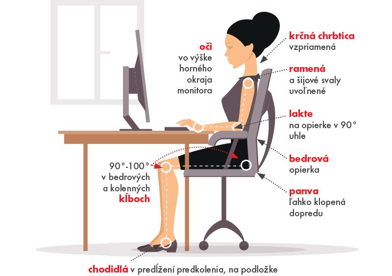

.. title: Ako správne sedieť
.. slug: ako-spravne-sediet
.. date: 2018-02-10 15:35:43 UTC+02:00
.. tags: health, sitting, manual
.. category: 
.. link: 
.. description: 
.. type: text

Sedenie vplýva na naše zdravie
==============================

	„Sedenie je fajčenie súčasnosti."

– Nilofer Merchant v časopise `Harvard Business Review <https://hbr.org/2013/01/sitting-is-the-smoking-of-our-generation/>`_.

	„V Spojených štátoch amerických sa ročne premárni v priemere 149 miliónov pracovných dní kvôli bolestiam chrbta v bedrovej oblasti.“

– Svetová zdravotnícka organizácia `WHO <http://www.who.int/medicines/areas/priority_medicines/BP6_24LBP.pdf>`_.

	„K nesprávnemu držaniu tela dochádza často, keď sa človek sústredí na momentálnu prácu. Je veľmi ťažké vedome si udržať správne držanie tela.”

– `University of Illinois <http://www.mckinley.illinois.edu/handouts/posture_study_habits/posture_study_habits.htm>`_.

	„Ľudia strávia v priemere pol dňa (10 hodín) sedením a sú aktívni len menej než 2 hodiny denne.”

– `Britská asociácia chiropraktikov <http://www.chiropractic-uk.co.uk/sitting-comfortably-your-back-isnt-267-news.aspx>`_.

Ako správne sedieť
==================

1. Upravte si svoje pracovné prostredie
---------------------------------------
- Uprednostňujte ergonomické stoličky.
- Prispôsobte si výšku stola a stoličky, pozíciu operadla a uhol naklonenia klávesnice.
- Ubezpečte sa, že je horný okraj obrazovky na úrovni vašich očí alebo mierne nižšie. Ak používate notebook, snažte sa ho podložiť knihami tak, aby ste dosiahli výšku, ktorú potrebujete, a používajte doplnkovú klávesnicu a myš.
- Umiestnite obrazovku minimálne do vzdialenosti vašej vystretej ruky.

2. Seďte vzpriamene
-------------------
- Seďte tak, aby sa vaša zadná časť tela dotýkala operadla stoličky.
- Seďte vzpriamene a majte trup nahnutý v postavení 90 - 105°.
- Uvoľnite sa.
- Ubezpečte sa, že majú vaše lakte a zápästia podporu.
- Kolená by ste mali držať mierne nižšie než sú vaše boky.
- Chodidlá položte rovno na podlachu.
- Stanovte si ciele a sledujte pokrok pomocou Spine Hero.

3. Postavte sa a natiahnite sa
------------------------------
Naše telá sú uspôsobené na pohyb, a preto:

- Robte si pravidelné prestávky - postavte sa, natiahnite sa, zmeňte pozíciu sedenia alebo sa trošku prejdite.

.. youtube:: OyK0oE5rwFY
	:height: 315
	:width: 560
